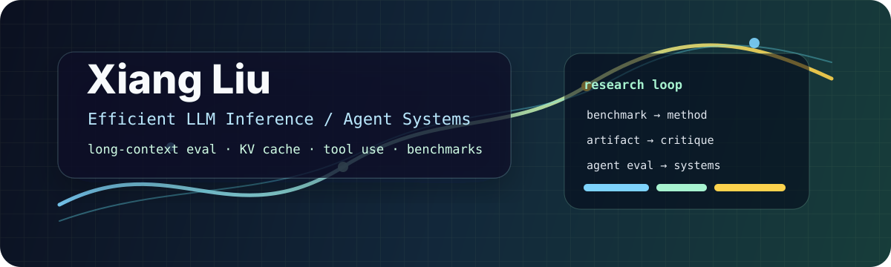

<p align="center">
  
</p>

<p align="center">
  <a href="https://xiangl-ml.github.io/"></a>
  <a href="https://scholar.google.com/citations?user=VtK5lwUAAAAJ"></a>
  <a href="https://twitter.com/Dominicliu12"></a>
</p>

<p align="center">
  <b>Ph.D. student @ HKUST(GZ)</b><br>
  Efficient and reliable LLMs: inference, long context, KV cache, retrieval, and agentic workflows.
</p>

<br>

<table>
  <tr>
    <td align="center" width="33%">
      <b>400+ stars</b><br>
      <sub>across 50 original repositories</sub>
    </td>
    <td align="center" width="33%">
      <b>3.6k commits · 560+ PRs</b><br>
      <sub>past year, public activity</sub>
    </td>
    <td align="center" width="33%">
      <b>benchmark → method → artifact</b><br>
      <sub>how I like research to ship</sub>
    </td>
  </tr>
</table>

## Current Focus

<table>
  <tr>
    <td width="50%">
      <b>Inference efficiency</b><br>
      <sub>KV-cache compression, token-efficient reasoning, energy-to-token evaluation, serving bottlenecks.</sub>
    </td>
    <td width="50%">
      <b>Long-context evaluation</b><br>
      <sub>Generation-focused benchmarks, dense reasoning integrity, multi-turn coherence.</sub>
    </td>
  </tr>
  <tr>
    <td width="50%">
      <b>Agent systems</b><br>
      <sub>Tool use, post-training, harness design, local-first agent workflow infrastructure.</sub>
    </td>
    <td width="50%">
      <b>Research infrastructure</b><br>
      <sub>Reproducible artifacts, project pages, scholar tracking, figure and report tooling.</sub>
    </td>
  </tr>
</table>

## Selected Work

<table>
  <tr>
    <td width="50%">
      <h3><a href="https://github.com/Dominic789654/LongGenBench">LongGenBench</a></h3>
      <p>Long-context <b>generation</b> benchmark for coherent, context-aware long-form responses — the gap left open by extractive needle-in-a-haystack tests.</p>
      <p>
        
        
        
      </p>
    </td>
    <td width="50%">
      <h3><a href="https://github.com/Dominic789654/quantarena-clean">QuantArena</a></h3>
      <p>Policy-conditioned live-market evaluation for LLM trading agents. Benchmark the policy, not just the model.</p>
      <p>
        
        
        
      </p>
    </td>
  </tr>
  <tr>
    <td width="50%">
      <h3><a href="https://github.com/Dominic789654/energy-to-token">energy-to-token</a></h3>
      <p>Position paper project page: LLM inference should be evaluated as <b>energy-to-token production</b>, not tokens per second alone.</p>
      <p>
        
        
      </p>
    </td>
    <td width="50%">
      <h3><a href="https://github.com/Dominic789654/agent-hub">agent-hub</a></h3>
      <p>Local-first agent task hub: SQLite queueing, dependency-aware dispatch, templates, pipelines, and a thin dashboard.</p>
      <p>
        
        
      </p>
    </td>
  </tr>
  <tr>
    <td width="50%">
      <h3><a href="https://github.com/Dominic789654/tinker2openai-tool">tinker2openai-tool</a></h3>
      <p>Adapters between XML-like tool calls and OpenAI-style structured tool-call histories — for post-training and eval harnesses.</p>
      <p>
        
        
      </p>
    </td>
    <td width="50%">
      <h3><a href="https://github.com/Dominic789654/scientific-figure">scientific-figure</a></h3>
      <p>Tooling for publication-grade scientific figures — reproducible, paper-ready plots without the last-minute scramble.</p>
      <p>
        
        
        
      </p>
    </td>
  </tr>
</table>

## Upstream Contributions

Merged PRs into other people's projects — 29 outside my own repositories.

<table>
  <tr>
    <td width="50%">
      <h3><a href="https://github.com/OptimalScale/LMFlow">LMFlow</a> · 8.5k★</h3>
      <p><b>15 merged PRs</b> — LISA (reasoning-aware fine-tuning), DoRA and Hymba support, LoRA target-module fixes, eval-during-training, large-data preprocessing.</p>
    </td>
    <td width="50%">
      <h3><a href="https://github.com/NVIDIA/kvpress">kvpress</a> · 1.2k★</h3>
      <p>Merged <b><code>add ChunkKV</code></b> — chunk-wise KV-cache compression for long-context inference.</p>
    </td>
  </tr>
  <tr>
    <td width="100%">
      <h3>Ecosystem lists &amp; tooling</h3>
      <p>Merged into <a href="https://github.com/filipecalegario/awesome-vibe-coding">awesome-vibe-coding</a> (5.3k★), <a href="https://github.com/Chenruishuo/posterly">posterly</a> (411★), <a href="https://github.com/tatsu-lab/alpaca_eval">alpaca_eval</a> (2k★), <a href="https://github.com/dair-ai/Prompt-Engineering-Guide">Prompt-Engineering-Guide</a>.</p>
    </td>
  </tr>
</table>

## Open Source & Community

The tooling layer around agent research — mostly reusable skills and curated indexes.

<table>
  <tr>
    <td width="50%">
      <h3><a href="https://github.com/Dominic789654/awesome-deepseek-harness">awesome-deepseek-harness</a> · 353★</h3>
      <p>A curated list of plugins, skills, MCP servers, patch/profile layers, orchestrators &amp; UIs for <b>DeepSeek Harness (DSH)</b>.</p>
      <p>
        
        
        
      </p>
    </td>
    <td width="50%">
      <h3>Agent skills</h3>
      <p>
        <a href="https://github.com/Dominic789654/auto-research">auto-research</a> ·
        <a href="https://github.com/Dominic789654/auto-kernel-research">auto-kernel-research</a> ·
        <a href="https://github.com/Dominic789654/EvoHarness.skills">EvoHarness.skills</a><br>
        <a href="https://github.com/Dominic789654/critical-reviewer-skill">critical-reviewer-skill</a> (3★) ·
        <a href="https://github.com/Dominic789654/openspec-grillme">openspec-grillme</a> (3★)<br>
        <a href="https://github.com/Dominic789654/kimi-code-skills">kimi-code-skills</a> ·
        <a href="https://github.com/Dominic789654/qwen-code-skills">qwen-code-skills</a> ·
        <a href="https://github.com/Dominic789654/claude-code-skills">claude-code-skills</a>
      </p>
      <p><sub>Autonomous research loops, kernel optimization, academic review, spec-driven development, model-specific delegators.</sub></p>
    </td>
  </tr>
  <tr>
    <td width="50%">
      <h3>Evaluation &amp; infra</h3>
      <p>
        <a href="https://github.com/Dominic789654/llm_benchmark_eval">llm_benchmark_eval</a> ·
        <a href="https://github.com/Dominic789654/llm-benchmark-research">llm-benchmark-research</a><br>
        <a href="https://github.com/Dominic789654/agentic-dataset-builder">agentic-dataset-builder</a> ·
        <a href="https://github.com/Dominic789654/model-case-repros">model-case-repros</a><br>
        <a href="https://github.com/Dominic789654/scholar_tracker">scholar_tracker</a> ·
        <a href="https://github.com/Dominic789654/KimiQuota">KimiQuota</a>
      </p>
    </td>
    <td width="50%">
      <h3>Writing &amp; artifacts</h3>
      <p>
        <a href="https://github.com/Dominic789654/ai-semiconductor-bottleneck-atlas">ai-semiconductor-bottleneck-atlas</a><br>
        <a href="https://github.com/Dominic789654/llm-inference-tutorials">llm-inference-tutorials</a> ·
        <a href="https://github.com/Dominic789654/Paper-List">Paper-List</a><br>
        <a href="https://github.com/Dominic789654/Reading-note">Reading-note</a> ·
        <a href="https://github.com/Dominic789654/WeLM-blog">WeLM-blog</a>
      </p>
      <p><sub>Web decks, reading notes, and project pages for papers.</sub></p>
    </td>
  </tr>
</table>

## Research Map

```text
long-context generation ──┬── LongGenBench
                          ├── semantic integrity under KV compression
                          └── multi-turn coherence / FlowKV

agent capability eval ────┬── QuantArena
                          ├── tool-use adapters
                          └── local-first agent workflow runtime

efficient inference ──────┬── ChunkKV / KV compression
                          ├── token-efficient reasoning
                          └── energy-to-token production

research tooling ─────────┬── benchmark & dataset builders
                          ├── figure / report / poster pipelines
                          └── agent skill ecosystem (DSH, Codex, Claude)
```

## Stack

<p>
  
  
  
  
  
  
</p>

<p align="center">
  
  
</p>

<p align="center">
  <a href="https://github.com/Dominic789654?tab=repositories">repositories</a>
  ·
  <a href="https://xiangl-ml.github.io/#publications">publications</a>
  ·
  <a href="https://scholar.google.com/citations?user=VtK5lwUAAAAJ">citations</a>
</p>
